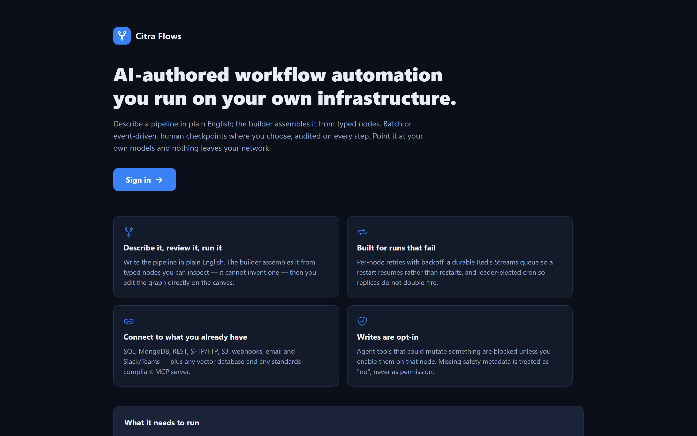
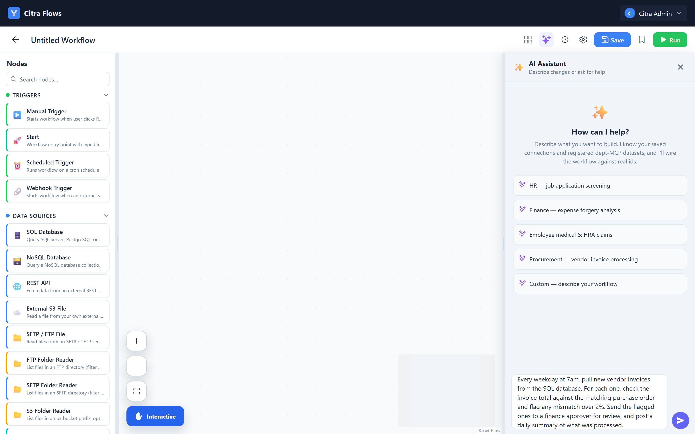
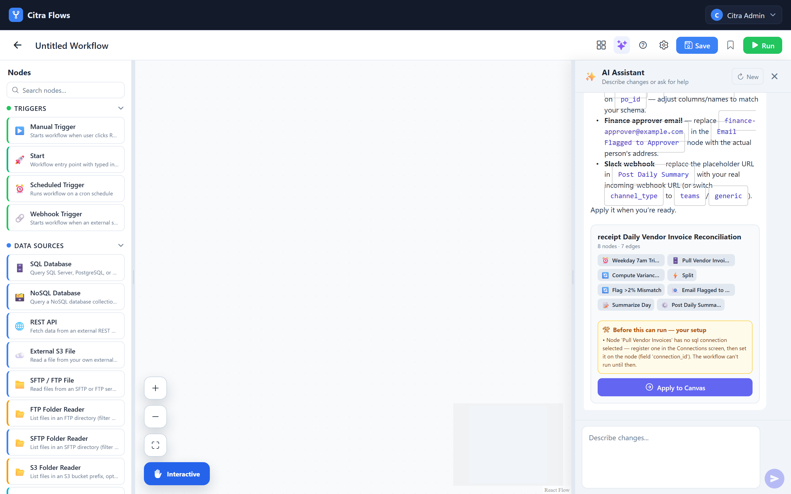
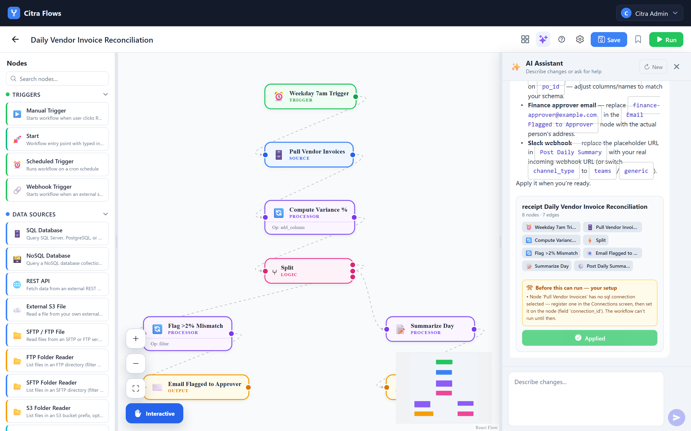

<!--
  Copyright (c) 2026 Trustedwear Tech Private Limited (https://citra-ai.com)
  Author: Rohit Kumar Chandan
  SPDX-License-Identifier: Apache-2.0

  Licensed under the Apache License, Version 2.0 (the "License"); you may not
  use this file except in compliance with the License. You may obtain a copy of
  the License at http://www.apache.org/licenses/LICENSE-2.0
-->

# Citra Flows

**AI-authored workflow automation you run on your own infrastructure.**

Describe a pipeline in plain English. The builder assembles it from typed nodes
you can open, inspect and edit on a canvas — it cannot invent one. Run it,
watch every node's input and output, then deploy it behind a webhook or a cron
schedule. Point it at your own models and nothing leaves your network.

```bash
make wizard                      # generates .env with fresh secrets, then starts everything
python scripts/smoke_test.py     # signs in, runs a workflow, asserts it completed
```

That works as-is on **Linux and macOS**. On **Windows**, `make` does not exist —
run the same wizard from **Git Bash** (installed with
[Git for Windows](https://git-scm.com/download/win); WSL works too):

```bash
bash scripts/quickstart/wizard.sh
python scripts/smoke_test.py
```

The smoke test and every `docker compose` command run in any shell —
PowerShell included; only the `.sh` scripts and `make` need a POSIX shell.
Then open <http://localhost:8088>. Full guide, including a no-scripts path
that is pure `docker compose`: [`INSTALL.md`](INSTALL.md).

## Support this project

Citra Flows is Apache-2.0 and free to run on your own infrastructure, forever.
Sponsorship funds maintenance, the documentation, and the hosted demo people try
before they self-host.

**[→ Support this project](https://citra-ai.com/open-source)**

<sub>Contributions go to Trustedwear Tech Private Limited, which maintains this
project. They are not tax-exempt donations, and they buy no licence, warranty,
support entitlement or influence over the roadmap — the project stays
Apache-2.0 either way.</sub>

---

## Draft → debug → ship

The point of the product is how short that loop is.


<p align="center">
  
</p>

<p align="center"><i>Self-hosted, on your own models. Nothing leaves your network.</i></p>

### 1. Draft it by describing it

Open the AI panel on the canvas and say what you want:


<p align="center">
  
</p>

<p align="center"><i>The brief, in the box. Typed nodes on the left — the assistant assembles from these, it cannot invent one.</i></p>

> *Every morning, pull yesterday's failed payments from Postgres, ask the model
> which are worth retrying, write those to a sheet and email me the rest.*

You get a real graph — nodes, edges, config — not a suggestion to copy out.
Three things make it trustworthy rather than a party trick:


<p align="center">
  
</p>

<p align="center"><i>What comes back is a <b>plan</b>, not a fait accompli: every node listed, and — under <i>Before this can run</i> — the SQL connection it needs and does not have. It tells you the workflow cannot run yet rather than producing something that looks finished and fails at 7am.</i></p>


<p align="center">
  
</p>

<p align="center"><i>After <b>Apply to Canvas</b>. Trigger, source, processor, branch and outputs — each one a typed node you can open and edit. The assistant drafted it; from here it is yours.</i></p>

- **It can only use nodes that exist.** The system prompt is built per request
  from the live node registry, so the model has no vocabulary for a node the
  engine cannot run.
- **It knows your connections.** Your saved connections are in the prompt too,
  so it wires `payments-db` rather than inventing a placeholder you have to
  find and fix.
- **Refining returns a diff, not a rewrite.** Ask for a change and the API
  answers with nodes/edges added, removed and updated. Your manual edits
  between AI turns survive; you review the patch before it lands.

Everything it produces is an ordinary workflow. Drag a node, retype a field,
delete half of it — the AI is a way to start, not a format you are locked into.

### 2. Debug it by running it

Hit **Run**, pick `test`, and watch it execute.

When something fails you get the node that failed, its error, how long it took,
how many times it was retried, and the raw input and output of every node that
ran before it. A failing REST call shows you the response. A transform that
dropped every row shows you the rows it started with.

Errors are meant to be actionable rather than merely honest. A misconfigured
transform tells you which parameter is missing and what a correct one looks
like; it does not surface a bare Python `KeyError`. A node that tries to reach
a private address says so, because that is a deliberate guard and not a bug.

### 3. Ship it

Deploying validates the graph, mints a webhook token, and registers the cron
schedule if the workflow has one. From there:

- **Versions** — every deploy snapshots the graph. Diff any two, roll back to
  any of them.
- **Test and prod are the same graph, different credentials.** A saved
  connection carries a separate config per environment, resolved at run time.
  You promote a workflow without editing it, and staging credentials cannot
  leak into a production run.
- **Triggers** — manual, cron, webhook (with a rotatable token), or a typed
  start that declares the inputs a run expects.
- **Human checkpoints** — drop in an approval node and the run pauses until
  someone decides.

## What you can build

Screen a thousand applicants down to ten. Pull yesterday's orders, evaluate
each against your rules, write the exceptions to a sheet and email the summary.
Watch an SFTP folder and process what lands. Reconcile two systems nightly and
raise only the differences. Retrieve from your vector store, rerank, and draft
a grounded answer a human signs off on.

The pipeline is the unit of work: the AI writes it, you review it, the engine
runs it on schedule with retries and an audit trail.

## Why an engine rather than a script

A script does the logic. The engine does everything around it:

| | |
|---|---|
| Retries | per-node, with backoff |
| Durability | Redis Streams — a restart resumes, it does not restart |
| Scheduling | leader-elected cron; replicas do not double-fire |
| Audit | every node's input, output and timing, per run |
| Credentials | saved connections resolved at run time, never in the graph |
| Isolation | connections are tenant-scoped and fail closed |

## The node catalogue

52 nodes, all typed and inspectable:

| | |
|---|---|
| **11 sources** | SQL, MongoDB, REST, S3, SFTP/FTP, folder readers, file fetch, vector search, MCP |
| **16 processors** | LLM, classify, extract, summarise, validate, dedupe, merge, transform, OCR, transcribe, embed, rerank, code |
| **8 logic** | condition, switch, loop, parallel split, merge/wait, delay, set variable, human approval |
| **11 outputs** | SQL write, Excel/CSV/PDF export, email, S3, SFTP, webhook, notify |
| **4 triggers** | manual, scheduled, webhook, typed start |
| **2 agents** | tool-calling agent, vision |

Two are deliberately generic:

- **`vector_search`** — any vector database: Qdrant, Milvus, Weaviate, pgvector,
  Chroma. Each is exercised by an integration test against a live server.
  Clients import lazily, so you install only the one you use.
- **`mcp_server`** — any standards-compliant Model Context Protocol server.
  `list_tools` to discover, `call_tool` to invoke.

Adding a node needs **no UI work** — the palette and the AI builder's vocabulary
are both generated from the backend registry.

## Safety

The agent node can call tools, and tools can mutate things. Write-capable tools
are blocked unless you opt in on that node. For MCP servers that means an
explicit `allow_writes` flag (default off), plus the protocol's `readOnlyHint` /
`destructiveHint` annotations, plus a name check for servers that publish
neither.

**Absence of metadata is never treated as permission.** A blocked write fails
the node loudly and is audited — it is not fed back to the model as a tool
result, and it is not retried, because retrying would only re-attempt the same
write. See [`ARCHITECTURE.md`](ARCHITECTURE.md) §6 for why that rule exists.

## Requirements

Mongo · Redis · object storage (S3/MinIO) · Docker for the `code_block` sandbox
· an OpenAI-compatible model endpoint.

The model endpoint is the only one you have to choose. Start on a hosted API to
evaluate; point `LLM_BASE_URL` at your own vLLM or Ollama for production and
nothing leaves your network. Everything except the AI features — the builder,
sources, transforms, logic, outputs, scheduling, approvals — runs without a
model at all.

Three processes make up the product and **all three are required**: the API, the
web UI, and the worker that executes runs. The API only enqueues a run; without
a worker, every run sits in `queued` while the stack reports itself healthy.

Sign-in is required rather than optional: workflows, runs and saved connections
belong to a user, and every API call is authorised on that identity. Accounts
live in **Citra-User-Service**, which the quickstart stack bundles (from the
`citra-common`, vendored into this repository); the first account is seeded from
`ADMIN_EMAIL` / `ADMIN_PASSWORD` in `.env`. There is no public sign-up.

## Architecture

See [`ARCHITECTURE.md`](ARCHITECTURE.md) for the execution model, provenance in
[`VENDORED.md`](VENDORED.md), and known gaps in [`PORTING.md`](PORTING.md).

## Community

**Discord:** https://discord.gg/yhQA8fwKZ
— shared with Citra Decks and Citra Projects. Questions, setup issues, or what
a real deployment needs that isn't here yet.

## Licence

**Apache License 2.0** -- open source, no strings.

Use it, modify it, run it in production, offer it as a service, fold it into a
commercial product. No non-production restriction, no Change Date, no licence to
buy. See [`LICENSE`](LICENSE) and [`NOTICE`](NOTICE).

There is no dual licence, no open-core split, and no commercial tier of this
code: what is here is the whole product under one licence.

(For the record, an earlier release reserved production use. That was dropped
before this repository was made public, and it cannot return -- an Apache grant,
once given, is irrevocable.)

The vendored `citra-common` tree is Apache-2.0 too — see its own LICENSE and
NOTICE.

Trustedwear Tech Private Limited · contact@citra-ai.com · https://citra-ai.com
